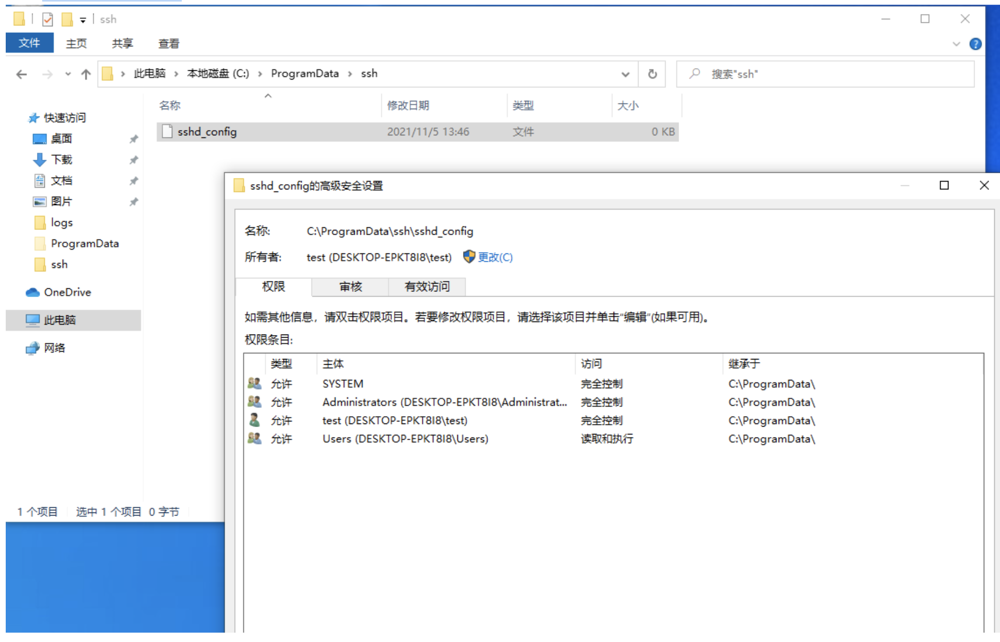
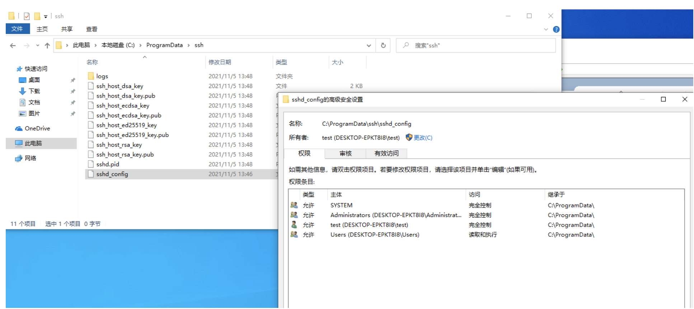

## OpenSSH-Win32-Deny-Of-Service

[Details Here](https://github.com/PowerShell/Win32-OpenSSH/issues/1900)

[Fixed Version](https://github.com/PowerShell/Win32-OpenSSH/releases/tag/v8.9.0.0p1-Beta)

## Description
In Windows OS before win10 version 1903, there is no folder C:\ProgramData\ssh before openssh server service started. Openssh server service will generate file named sshd_config under folder C:\ProgramData\ssh at the first time it was started.
In most cases, Administrators install openssh server and start it before all users use it, and it is safe in these cases.
Howerver, as we all know, all account in Users group could write data into folder C:\ProgramData，so there is another possibility that an attacker with low privilege can make folder C:\ProgramData\ssh and create file named sshd_config before the first time openssh server service started. In this case, an attacker can control sshd_config as I tested.

## Proof Of Concept
First, I make folder C:\ProgramData\ssh and create file named sshd_config with test account in Users group like this.

Then, I switch to administrator and start openssh server service. As you can see, openssh service does't replace it with default config, and test account in Users group can still control it.

Finally, in this case, Users can config openssh server service and lead to denial of service such as add DENY rules.

