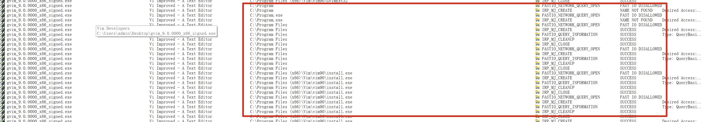

## Gvim Installer Vuln

## Basic Info

SoftWare Name：gvim

Software Version：gvim 9.0.00000

Download ：https://www.vim.org/download.php

Description：When install  gvim in windows. The installer will use CreateProcessW to create a new process. However,  there is a misuse problem in it. An attacker which have write permission of `C:\` can hijack `C:\Program.exe` to execute arbitrary code.

## Vuln Analyse

When install  gvim in windows. The installer will use CreateProcessW to create a new process with `C:\Program Files (x86)\Vim\vim90\install.exe`. 

However,  there is a misuse problem in it. An attacker which have write permission of `C:\` can hijack `C:\Program.exe` to execute arbitrary code.

## Proof Of Concept

[poc video](./poc.mp4)

1. copy C:\Windows\system32\calc.exe to C:\Program.exe
2. Install gvim. Then we can see the calculator.