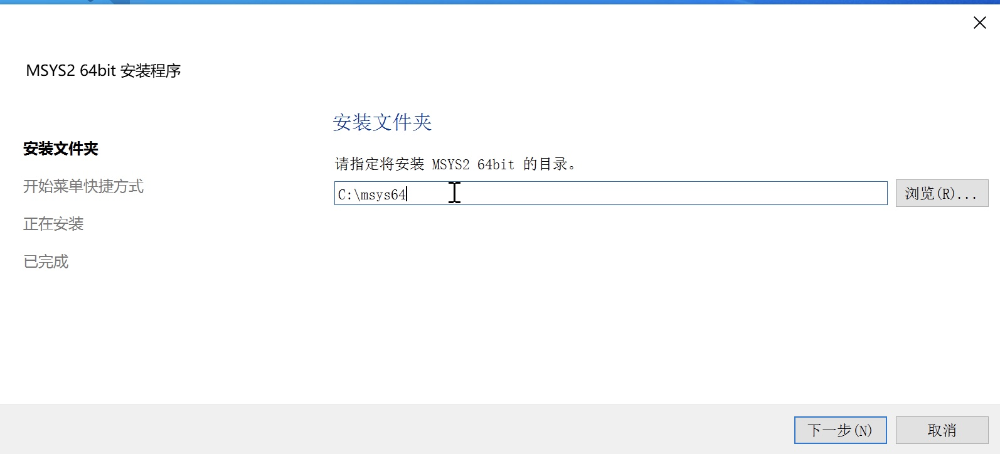
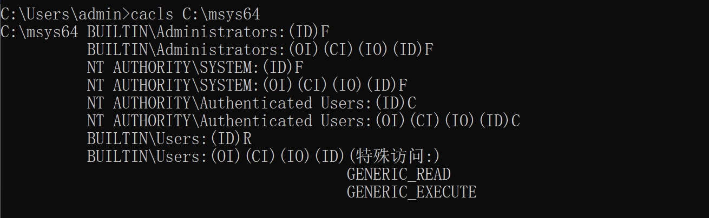
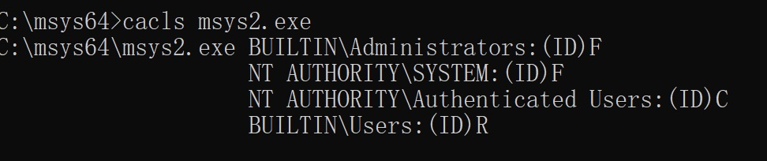

## Incorrect default permission of Msys2 dir

## Basic Info

Description：The default install dir of Wamp is `C:\msys64`.Howerver, the permission of `C:\msys64 is `inherited from C:\, so all Users in Authenticated Users group have write permission of `C:\msys64` and files in it.

Vuln Type: CWE-276

Vuln influence: arbitrary code execution

Download: https://www.msys2.org/

Vuln Version: 20220603 and below

## Vuln Analyse

The default install dir of Msys2 is `C:\msys64`

howerver, the permission of  `C:\Msys64 is inherited from` `C:\`.

All Users in Authenticated Users group have write permission of `C:\Msys64` and files in it.

So an attacker with low privilege can hijack binary like msys2.exe to execute arbitrary code when administrator or other users use it.

