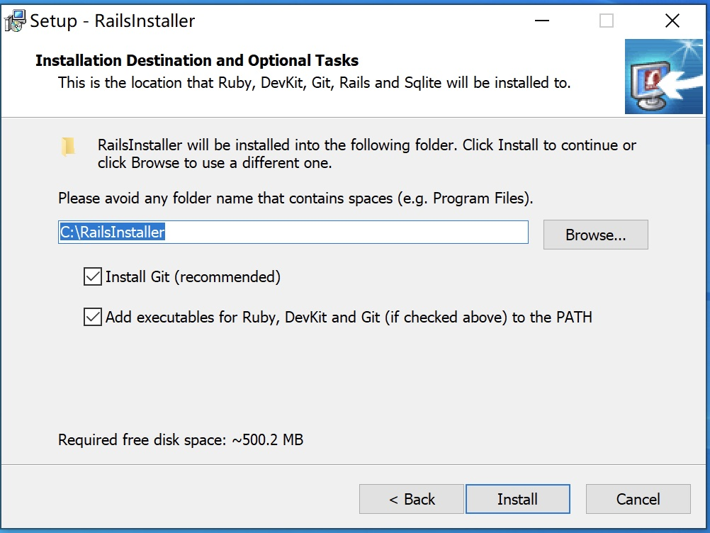
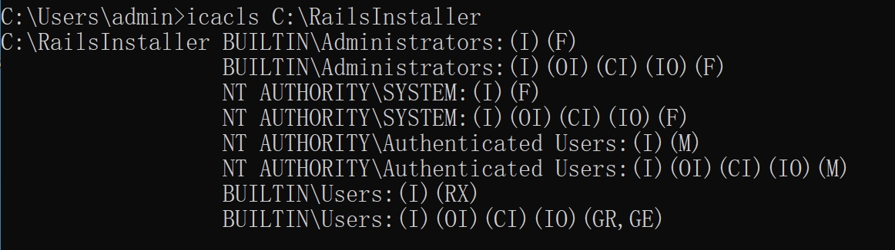
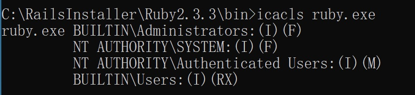

## Incorrect default permission of RailsInstaller dir

## Basic Info

Description：The default install dir of RailsInstaller is `C:\RailsInstaller`, howerver, the permission of `C:\RailsInstaller` is inherited from C:\, so all Users in Authenticated Users group have write permission of `C:\RailsInstaller` and files in it.

Vuln Type: CWE-276

Vuln influence: arbitrary code execution

Download:https://railsinstaller.org/

Vuln Version:  3.4.0 and below

## Vuln Analyse

The default install dir of RailsInstaller is `C:\RailsInstaller`

howerver, the permission of `C:\RailsInstaller` is inherited from `C:\`.

All Users in Authenticated Users group have write permission of `C:\RailsInstaller` and files in it.

So an attacker with low privilege can hijack binary like ruby.exe to execute arbitrary code when administrator or other users use ruby installed by RailsInstaller

