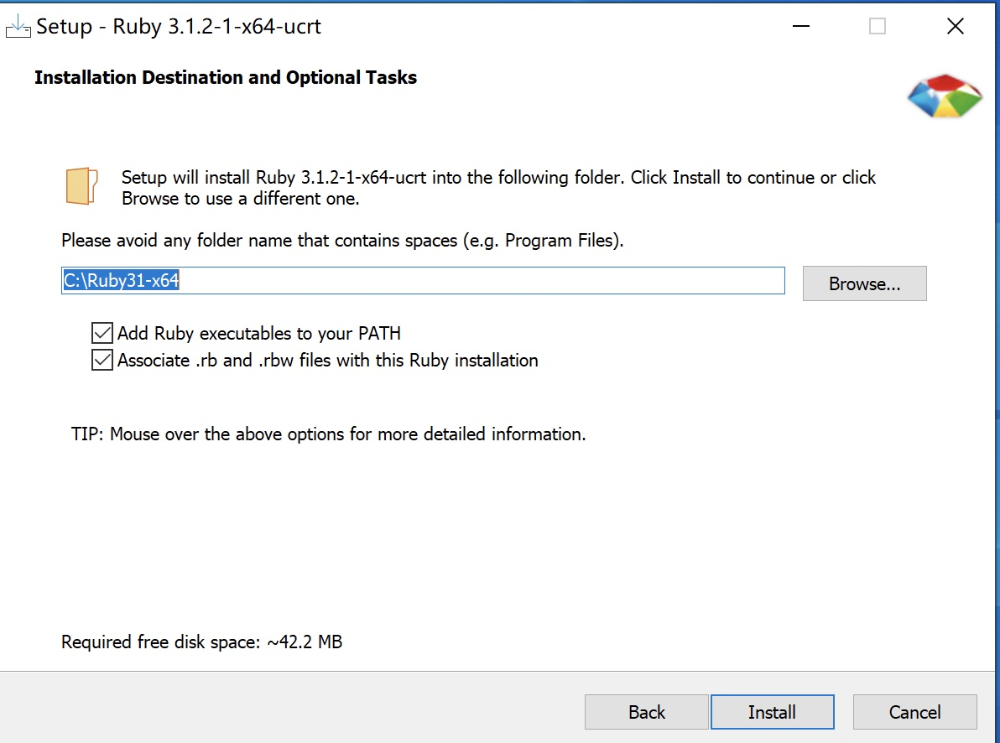
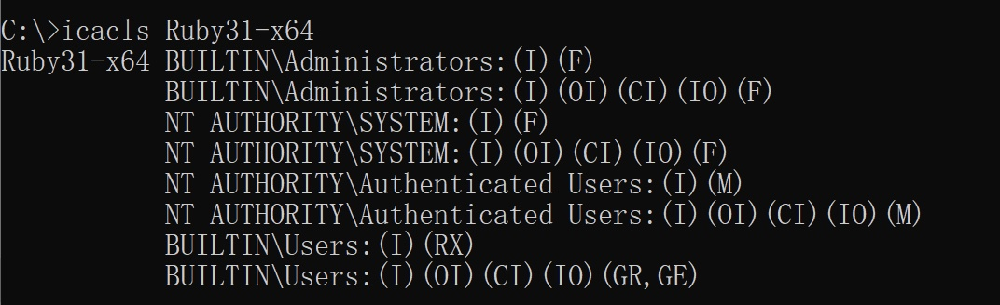

## Incorrect default permission of Ruby install2 dir

## Basic Info

Description：The default install dir of rubyinstaller2 is `C:\Ruby31-x64`, howerver, the permission of `C:\Ruby31-x64` is inherited from C:\, so all Users in Authenticated Users group have write permission of `C:\Ruby31-x64` and files in it.

Vuln Type: CWE-276

Vuln influence: arbitrary code execution

Download:https://github.com/oneclick/rubyinstaller2/tags

Vuln Version: ruby-3.1.2-1 and below

## Vuln Analyse

The default install dir of RubyInstaller2 is `C:\Ruby31-x64`

howerver, the permission of `C:\Ruby31-x64` is inherited from C:\.

All Users in Authenticated Users group have write permission of `C:\Ruby31-x64` and files in it.

So an attacker with low privilege can hijack binary like ruby.exe to execute arbitrary code when administrator or other users use ruby installed by rubyinstaller2

