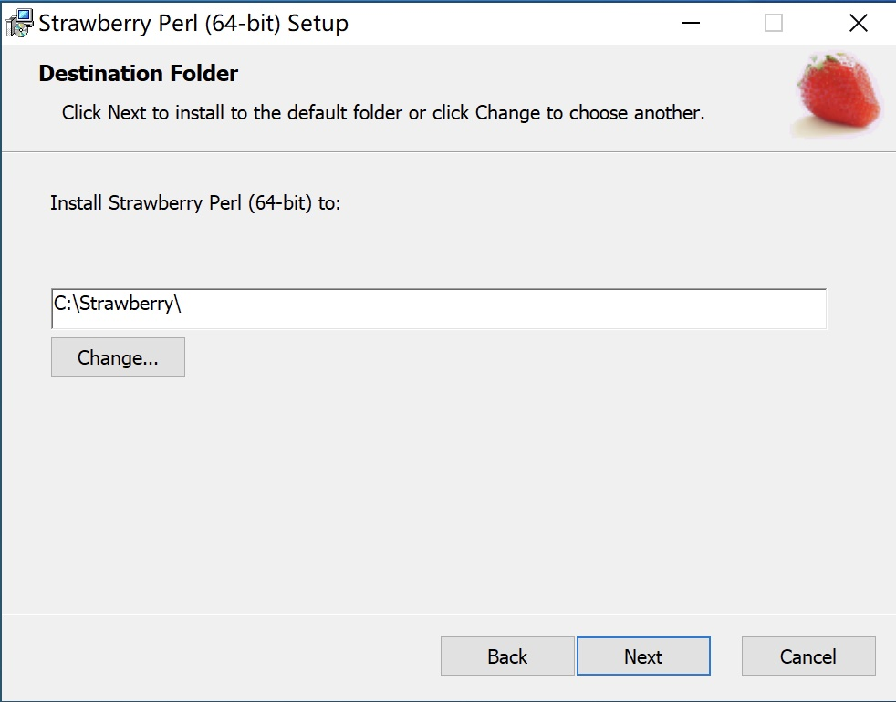
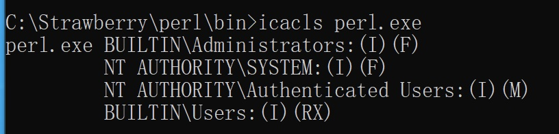

## Incorrect default permission of StrawberryPerl dir

## Basic Info

Description：The default install dir of StrawberryPerl is `C:\Strawberry`.Howerver, the permission of `C:\Strawberry is `inherited from C:\, so all Users in Authenticated Users group have write permission of `C:\Strawberry` and files in it.

Vuln Type: CWE-276

Vuln influence: arbitrary code execution

Download: https://strawberryperl.com/

Vuln Version: 5.32.1.1 and below

## Vuln Analyse

The default install dir of StrawberryPerl is `C:\Strawberry`

howerver, the permission of ` `C:\Strawberry is inherited from` C:\`.

All Users in Authenticated Users group have write permission of `C:\Strawberry` and files in it.

So an attacker with low privilege can hijack binary like perl.exe to execute arbitrary code when administrator or other users use perl installed by StrawberryPerl

