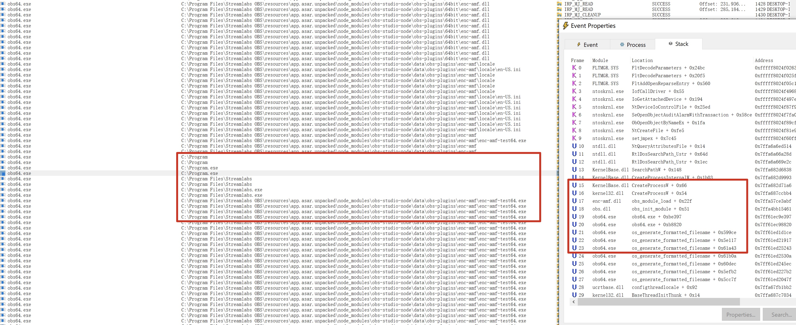

# Streamlabs Desktop Application CreateProcessW API Misuse

## Basic Info

Software : Streamlabs Desktop Application 

Version：1.9.0 

Test OS System：Windows 10

## Vuln Analyse

When started streamlabs in Windows, obs64.exe will try to create a new process (C:\Program Files\Stream Labs OBS\resources\app.asar.unpacked\node_modules\obs-studio-node\data\obs-plugins\enc-amf\enc-amf-test64.exe) with CreateProcessW API.

However, the code in enc-amf.dll misuse CreateProcessW api, so it will try to load C:\Program.exe first. 

An attacker can put malicious Program.exe under C:\ and execute arbitrary code when other users use SreamLabs.

## Proof Of Concept

1. copy C:\Windows\System32\calc.exe to Program.exe
2. Start StreamLabs, then we can see the calculator after a few seconds.

[poc.mp4](./poc.mp4)

