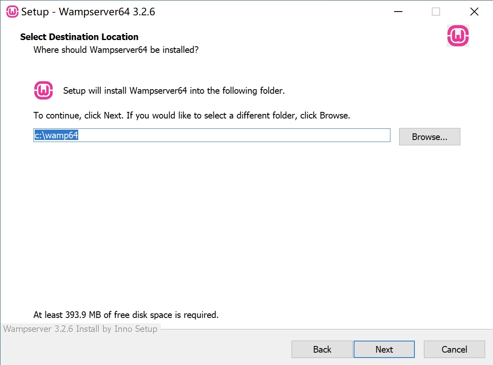
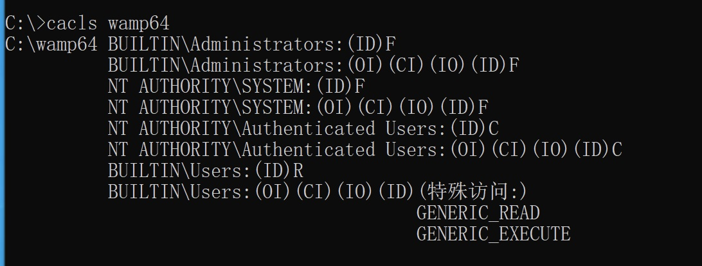
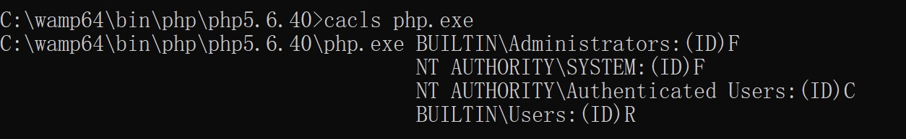

## Incorrect default permission of Wamp dir

## Basic Info

Description：The default install dir of Wamp is `C:\Wamp64`.Howerver, the permission of `C:\Wamp64 is `inherited from C:\, so all Users in Authenticated Users group have write permission of `C:\Wamp64` and files in it.

Vuln Type: CWE-276

Vuln influence: arbitrary code execution

Download: https://www.wampserver.com/en/

Vuln Version: 3.2.6 and below

## Vuln Analyse

The default install dir of Wamp is `C:\Wamp64`

howerver, the permission of  `C:\Wamp64 is inherited from` `C:\`.

All Users in Authenticated Users group have write permission of `C:\Wamp64` and files in it.

So an attacker with low privilege can hijack binary like php.exe to execute arbitrary code when administrator or other users use php.exe installed by Wamp.

