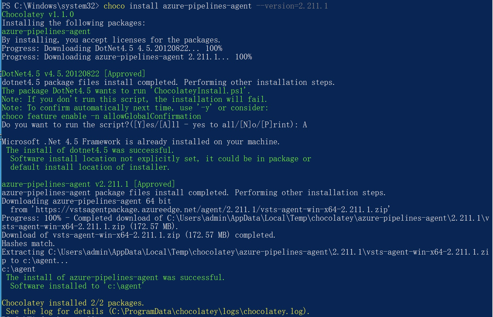
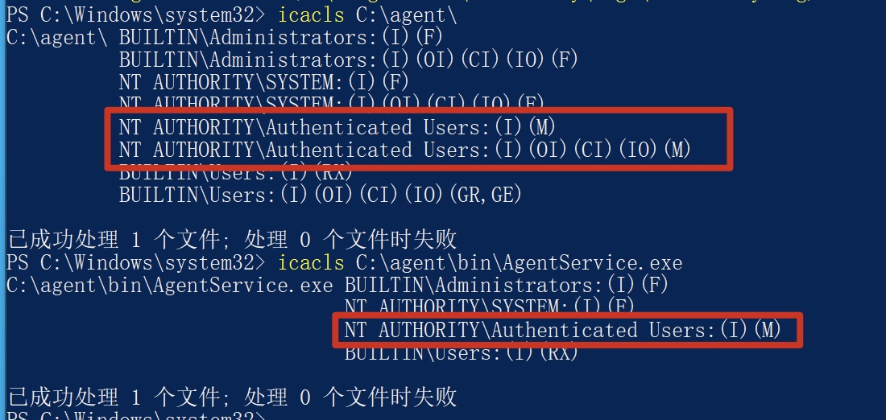

## Incorrect default permission of Azure-piplines-agent if installed by chocolatey

## Basic Info

Description：If we use chocolaty to install azure-pipelines-agent in windows System.The default install dir of azure-pipelines-agent is C:\agent howerver, the permission of C:\agent  is inherited from C:\, so all Users in Authenticated Users group have write permission of  path  C:\agent  and files in it.

Vuln Type: CWE-276

Website:https://community.chocolatey.org/packages/azure-pipelines-agent

Install Command : choco  install azure-pipelines-agent --version=2.211.1

Vuln Version: azure-pipelines-agent version 2.211.1 and below

## Vuln Analyse

- Use chocolatey to install azure-pipelines-agent in Windows system

- We can see that All Users in Authenticated Users group have write permission of C:\agent  and files in it.

So an attacker with low privilege can hijack binary like C:\agent\bin\AgentService.exe to execute arbitrary code when administrator or other users use azure-pipelines-agent installed by chocolatey.

