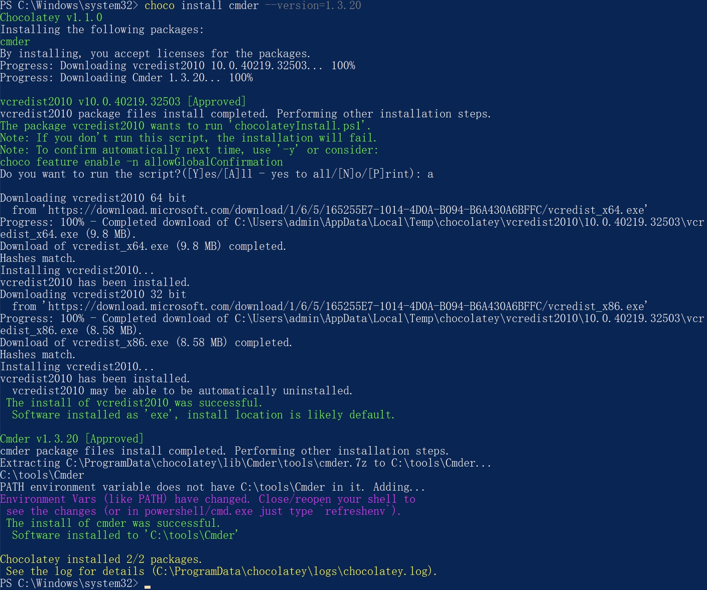
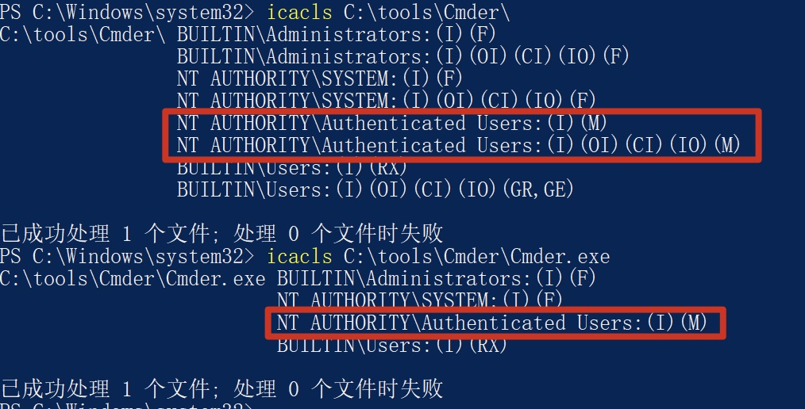

## Incorrect default permission of Cmder if installed by chocolatey

## Basic Info

Description：If we use chocolaty to install cmder in windows System.The default install dir of cmder is C:\tools\Cmder, howerver, the permission of C:\tools\Cmder is inherited from C:\, so all Users in Authenticated Users group have write permission of  path  C:\tools\Cmder and files in it.

Vuln Type: CWE-276

Website: https://community.chocolatey.org/packages/cmder

Install Command : choco install cmder --version=1.3.20

Vuln Version:  cmder 1.3.20 and below

## Vuln Analyse

- Use chocolatey to install Cmder in Windows system

- We can see that All Users in Authenticated Users group have write permission of C:\tools\Cmder and files in it.

So an attacker with low privilege can hijack binary likeC:\tools\Cmder\Cmder.exe to execute arbitrary code when administrator or other users use cmder installed by chocolatey.

