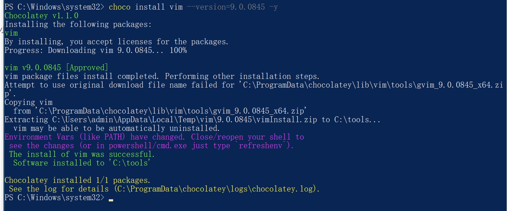
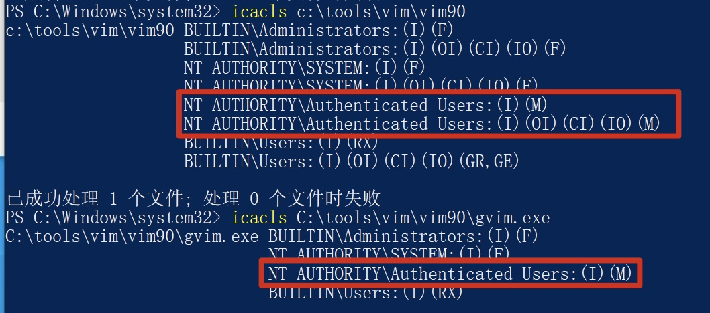

## Incorrect default permission of gvim if installed by chocolatey

## Basic Info

Description：If we use chocolaty to install gvim in windows System.The default install dir of gvim is C:\tools\vim\vim90, howerver, the permission of C:\tools\vim\vim90 is inherited from C:\, so all Users in Authenticated Users group have write permission of    path  C:\tools\vim\vim90 and files in it.

Vuln Type: CWE-276

Website: https://community.chocolatey.org/packages/vim

Install Command : choco install vim --version=9.0.0845

Vuln Version:  gvim 9.0.0845 and below

## Vuln Analyse

- Use chocolatey to install gvim in Windows system

- We can see that All Users in Authenticated Users group have write permission of C:\tools\vim\vim90 and files in it.

So an attacker with low privilege can hijack binary like C:\tools\vim\vim90\gvim.exe to execute arbitrary code when administrator or other users use gvim installed by chocolatey.

