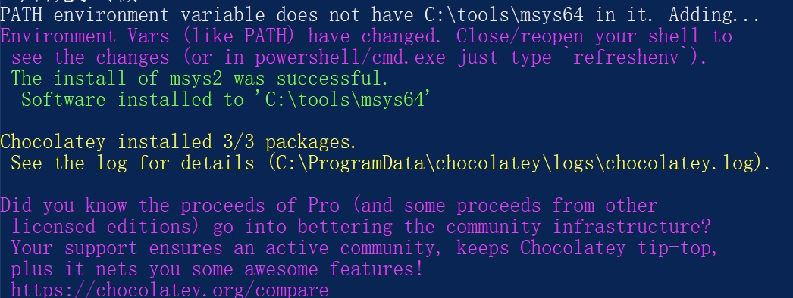
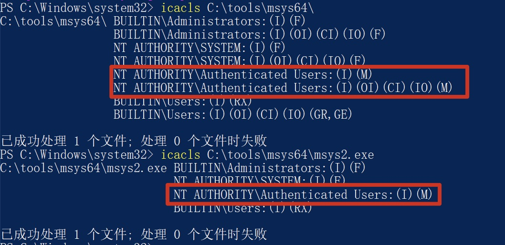

## Incorrect default permission of msys2 if installed by chocolatey

## Basic Info

Description：If we use chocolaty to install msys2 in windows System.The default install dir of msys2 is C:\tools\msys64, howerver, the permission of C:\tools\msys64 is inherited from C:\, so all Users in Authenticated Users group have write permission of  path  C:\tools\msys64 and files in it.

Vuln Type: CWE-276

Website: https://community.chocolatey.org/packages/msys2

Install Command : choco  install msys2 --version=20220904.0.0

Vuln Version:  msys2 20220904.0.0 and below

## Vuln Analyse

- Use chocolatey to install msys2 in Windows system

- We can see that All Users in Authenticated Users group have write permission of C:\tools\msys64 and files in it.

So an attacker with low privilege can hijack binary like C:\tools\msys64\msys2.exe to execute arbitrary code when administrator or other users use msys2 installed by chocolatey.

