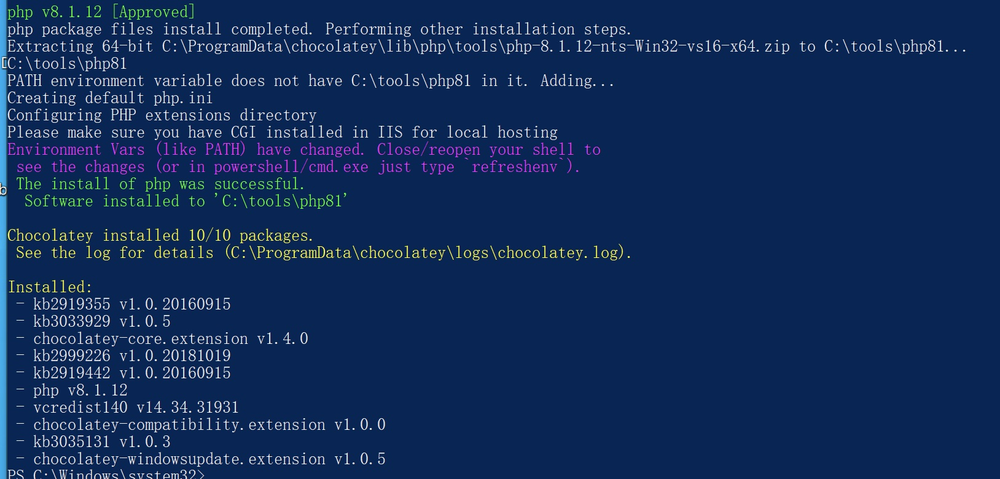

## Incorrect default permission of php if installed by chocolatey

## Basic Info

Description：If we use chocolaty to install php in windows System.The default install dir of php is C:\tools\php81, howerver, the permission of C:\tools\php81 is inherited from C:\, so all Users in Authenticated Users group have write permission of  path  C:\tools\php81  and files in it.

Vuln Type: CWE-276

Website: https://community.chocolatey.org/packages/php

Install Command : choco install php --version=8.1.12

Vuln Version:  php 8.1.12 and below

## Vuln Analyse

- Use chocolatey to install php in Windows system

- We can see that All Users in Authenticated Users group have write permission of C:\tools\php81 and files in it.

So an attacker with low privilege can hijack binary like C:\tools\php81\php.exe  to execute arbitrary code when administrator or other users use php installed by chocolatey.

