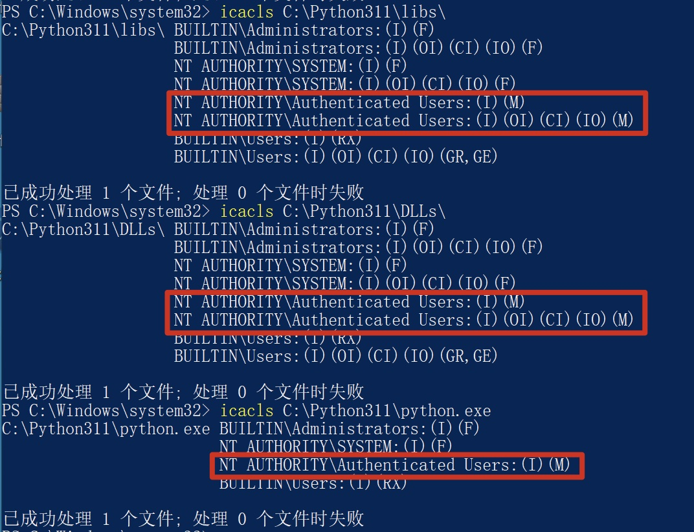

## Incorrect default permission of python3 if installed by chocolatey

## Basic Info

Description：If we use chocolaty to install python3 in windows System.The default install dir of python3 is C:\python311 , howerver, the permission of C:\Python311 is inherited from C:\, so all Users in Authenticated Users group have write permission of  subfolder of C:\Python311 and files in it.

Vuln Type: CWE-276

Website:https://community.chocolatey.org/packages/python3

Install Command : choco  install python3 --version=3.11.0

Vuln Version:  python3 3.11.0 and below

## Vuln Analyse

- Use chocolatey to install python3 in Windows system

- We can see that All Users in Authenticated Users group have write permission of subfolder of C:\Python311 (example : C:\Python311\libs and C:\Python311\DLLs) and files in it.

So an attacker with low privilege can hijack binary like C:\Python311\python.exe to execute arbitrary code when administrator or other users use python3 installed by chocolatey.

