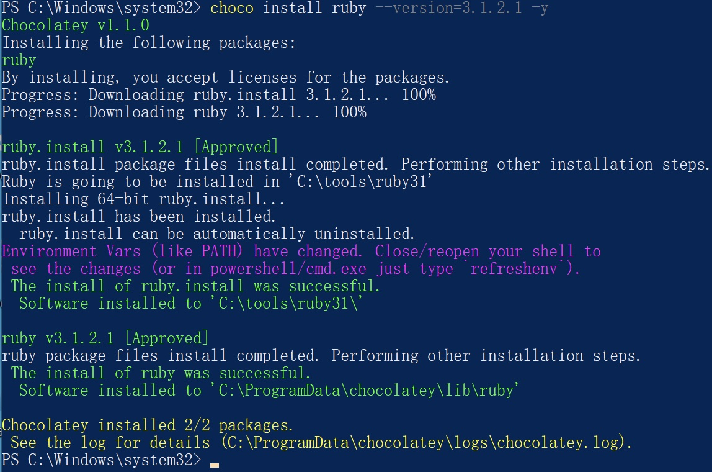

## Incorrect default permission of ruby if installed by chocolatey

## Basic Info

Description：If we use chocolaty to install ruby in windows System.The default install dir of ruby is C:\tools\ruby31, howerver, the permission of C:\tools\ruby31 is inherited from C:\, so all Users in Authenticated Users group have write permission of  path  C:\tools\ruby31 and files in it.

Vuln Type: CWE-276

Website: https://community.chocolatey.org/packages/ruby

Install Command : choco  install ruby --version=3.1.2.1

Vuln Version:  ruby 3.1.2.1 and below

## Vuln Analyse

- Use chocolatey to install ruby in Windows system

- We can see that All Users in Authenticated Users group have write permission of C:\tools\ruby31 and files in it.

So an attacker with low privilege can hijack binary likeC:\tools\ruby31\ruby.exe to execute arbitrary code when administrator or other users use ruby installed by chocolatey.

